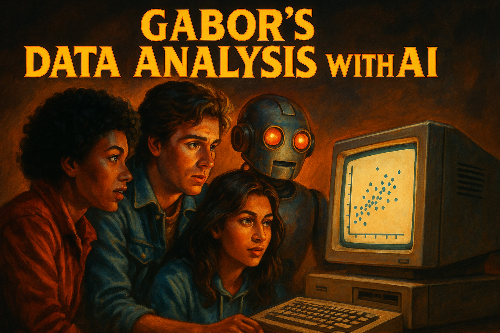

## What's this

A course for faculty and students who already know **data analysis / econometrics** and want to seriously rework their practice around AI. The aim is not "tips and tricks": it is to spend a semester **building real things with AI as a teammate**, and to think honestly about where it helps, where it lies, and where it lets you do work you genuinely could not do alone.

As AI becomes more and more powerful, it is also important to provide a platform to **discuss human agency in data analysis**. A core role of the instructor is to lead that discussion across the term — what we delegate, what we keep, and how we stay accountable for the result.

**This is the 2026 Summer edition release**

### Structure

The course is **eight 200-minute sessions** — a five-week core course plus a three-session capstone:

- **Week 1 — LLMs & Setup.** The one front-facing week: what LLMs are, the model-vs-harness distinction, closed vs open-weights models, and getting a working environment running on the two course harnesses.
- **Weeks 2–3 — Core Data Analysis.** Use AI on tasks students mostly *can* do unaided: a reproducible raw-data-to-report pipeline, then reviewing and debugging AI's work with instruction files, skills, and tests.
- **Weeks 4–5 — Research with AI.** AI as a research companion: causal identification (controls, instruments, difference-in-differences) and text-as-data with LLM APIs.
- **Capstone (3 sessions).** A team project that pushes students into work they have **never done before**: production-style **web scraping**, **text-as-data classification using LLM APIs**, and **modern causal econometrics** (difference-in-differences with staggered treatment, event-study designs). The whole point is that AI makes this newly accessible — and the course makes students actually do it.

### AI and me

At the end of all classes, instructors and students should always consider these three questions.

1. How did AI **support** me do what I planned.
2. How did AI **fail** me: gave half-truths, buggy code, imprecise arguments
3. How did AI **extend** me: helped do things I could not, or gave new ideas

## Course description

### Content — the core course

Weeks 1–5 cover using large language models (LLMs — ChatGPT, Claude, Gemini, Le Chat and others) to **carry out tasks in data analysis**: LLM and harness setup, a reproducible raw-data-to-report pipeline, reviewing and debugging AI's work, using AI as a research companion for controls/IV/DiD, and text-as-data on football interviews.

Several **case studies** run across the material — simulated hotel data from Austria, the World Values Survey, US CPS earnings, football manager post-match interviews. There are practice **assignments** and a [learning-more collection](da-knowledge/beyond.html) with blogs, papers, and video recommendations.

### Content — capstone

A three-session team project on **manager changes in football**. Each team picks a country, builds a 10+ season match-and-manager panel, scrapes news around each change, uses an LLM API to score how *expected* each change was, then runs a difference-in-differences analysis with heterogeneity by manager type, team, and expectation.

The capstone deliberately requires **three things students typically have not done**:

1. **Web scraping at project scale** — RSS feeds, article pages, hundreds to thousands of items across sources and languages.
2. **Text-as-data with LLM APIs** — designing a classification prompt, structured outputs, hand-validation against the model, cost and reproducibility.
3. **Modern causal econometrics** — staggered DiD, event-study specifications, parallel-trends diagnostics, anticipation effects.

The argument of the course is that **AI is what makes this scope realistic in three sessions** — and the capstone is where students prove that to themselves.

### Background: data analysis / econometrics

You need a background in **Data Analysis / Econometrics**, a good introductory course is enough. I, *of course*, suggest Chapters 1-12 and 19 of [Data Analysis for Business, Economics and Policy (Cambridge UP, 2021)](https://gabors-data-analysis.com/getting-started). Full slideshows, data and code are open source. But consider buying the book!🤝

In particular, the course builds on [Chapters 1-6 and 7-10, and 19 and 22-24 of Data Analysis ](https://gabors-data-analysis.com/chapter-details/) but other Introductory Econometrics + basics of data science knowledge is ok.

### Background: coding

Students are expected to have some basic **coding knowledge** in Python or R (Stata also fine for the early weeks). The capstone is realistically Python or R only — scraping and API work in Stata is painful.

### Relevance

AI is everywhere and has become essential, most analytic work will be using it. It's like the Internet a while back. Does not solve all problems, but almost all intellectual tasks will rely on inputs from it.

### Learning Outcomes

By the end of the course, students will be able to

* Use genAI fluently across the standard data-analysis stack — wrangling, description, reporting, light text analysis.
* Work with **agentic CLI tools** (Claude Code and similar) on a real repo, with reproducibility and tests.
* **Scrape** structured data from the web for a defined research goal.
* Use an **LLM API** to turn text into numbers, including prompt design, structured output, and hand-validation.
* Run a **modern difference-in-differences / event-study** analysis with staggered treatment and discuss its limits honestly.
* Distinguish AI uses where the output is fine as-is from those that need strong human supervision.
* Run a multi-week team project from data collection to causal analysis, using AI throughout.

### Target audience

The course is aimed primarily at **graduate and advanced-undergraduate students** in economics, quantitative social science, political science, sociology, business analytics, and adjacent fields — students who have done a real econometrics or data-analysis course and now need to reset their practice around AI. The capstone in particular assumes you are willing to push past your current toolkit.

The material is also designed to be **forkable by instructors**: all open source under CC BY-NC-SA, so teachers can pick weeks, swap case studies, and run their own version. Practitioners, researchers, and journalists with the background can absolutely go through it solo.

## Assignments

Assignments are available for all classes

Important to note for assignments: 
* Use AI but do not submit something that was created by AI. AI is your assistant.
* One of the goals of the course is to practice this. 

## The core course

::: {.callout-tip}
**Before Week 1.** Get your environment in shape and pick up a few prompting-for-code habits — see [AI Coding Prep](da-knowledge/ai-coding-prep.qmd). Skip it if you already use Copilot/Cursor on real projects.
:::

**Week 1: LLMs, Harnesses & Setup**

What LLMs are and how the magic happens — a non-technical intro. The model-vs-harness distinction, closed/frontier vs open-weights models, and the two course harnesses (Claude Code in terminal and desktop, VS Code + GitHub Copilot). Get a working environment running. See also [which AI model to use](da-knowledge/which-ai.html).

[Content](unit1/)

**Week 2: From Raw Data to Report**

Download real survey data, build a reproducible pipeline (explore → composite variables → aggregate → join an external API), and contrast an undirected "vibe report" with a carefully directed report.

Case study: [World Values Survey](case-studies/VWS/)

[Content](unit2/)

**Week 3: Data Wrangling & Debugging**

Reviewing AI's work: project instruction files (`CLAUDE.md` / `agents.md`), reusable skills, the three kinds of tests, git discipline, and safe autonomous execution.

Case study: [Austrian Hotels](case-studies/austria-hotels/)

[Content](unit3/)

**Week 4: Econometrics with AI**

AI as a research companion for causal identification — designing control sets (helpful vs adversarial), surfacing instruments via prompt chaining, and difference-in-differences.

[Content](unit4/)

**Week 5: Text as Data**

Football post-match interviews as the running case: the NLP pipeline, four ways to score sentiment, humans vs AI, and a text→data pipeline that scales via an LLM API.

Case study: [Football Manager Interviews](case-studies/interviews/)

[Content](unit5/)

## Capstone: three sessions — doing things you have never done

A three-session team project on **manager changes in football**, deliberately scoped so that each session forces students into territory they have not been in before. Pick a country, build a 10+ season panel, score the news, run the causal design. — [Project description](capstone/)

**Session 1 — Data collection & description.** Build a multi-table match-and-manager panel from messy public sources. Real entity resolution, real data quality work. — [Content](project01/)

**Session 2 — From text to expectations (web scraping + LLM APIs).** Scrape news articles around each manager change, then use an LLM API to score how *expected* the change was. Prompt design, structured output, hand-validation, cost. — [Content](project02/)

**Session 3 — Difference-in-Differences + final presentation.** Modern causal econometrics: staggered DiD, event-study, parallel-trends diagnostics, heterogeneity by manager / team / expectation. Honest presentation of what the data can and cannot say. — [Content](project03/)

---

## Rights and acknowledgement

### You can use it to teach and learn freely

**Attribution**: Békés, Gábor: "Data Analysis with AI: a comprehensive course", available at [gabors-data-analysis.com/ai-course/](https://gabors-data-analysis.com/ai-course/), v2.2. 2026-05-01.

You can fork it from the Github Repo.  [https://robeidat.github.io/BSU-AI-FACULTY/]

**License**: [CC BY-NC-SA 4.0](https://creativecommons.org/licenses/by-nc-sa/4.0/) -- share, attribute, non-commercial (contact me for corporate gigs)
